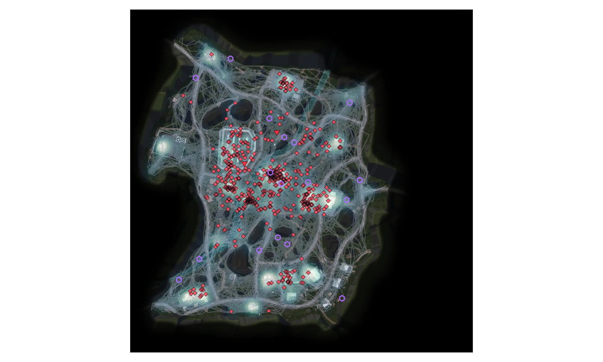
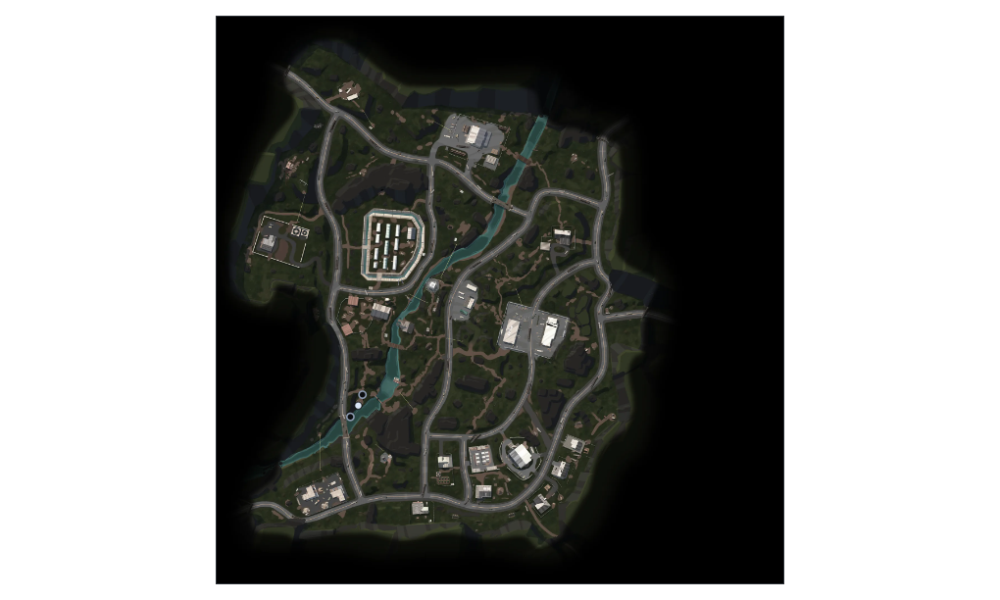

# LILA Player Journey

A level-design tool that turns raw match telemetry from **LILA BLACK** into an
interactive map view — player routes, combat, deaths, loot, and heatmaps — filterable by
map, date, match, and actor, with match playback.

**Live demo:** _[deployment URL — pending final deploy]_

## Key capabilities

- Render every player/bot's route on the correct minimap, with validated world→map
  coordinates
- Distinguish humans from bots by line style (dash + weight), never color alone
- Mark kills, deaths, storm deaths, and loot as distinct shapes, each with a tooltip
- Filter by map, date, match, and actor type — filters cascade, and every surviving
  match is searchable/selectable
- Scrub or play back a match on a real clock (0.5×–4×), with deterministic seeking
- Movement-sample / kill / death / loot heatmaps plus a caveated Low Activity overlay,
  decoupled from the playhead
- Keep large cohorts readable with explicit Auto / Show / Hide route controls
- Shift-drag a region on the map to get exact traffic/kill/death/storm counts for that
  area
- A visible data-quality panel — every dedup, actor-classification, and partial-roster
  caveat the pipeline found, surfaced in the UI, not buried in a doc

## Screenshots

**Traffic heatmap, death and storm markers — Ambrose Valley**



**A selected match, ready for playback**



*(Both are direct captures of the running app's canvas, not mockups.)*

## Feature overview

| Area | What it does |
|---|---|
| Map workspace | Canvas-rendered minimap with paths, event markers, and heatmap layered together; pan-free, fit-to-container, correct aspect per map |
| Filters | Map tabs, multi-select date picker, human/bot toggles, searchable match drill-down — all cascading off one shared selection |
| Player inspector | Click a route or pick from the list: actor id, human/bot, observed duration, kills, deaths, loot, and an explicitly-labeled *estimated* travel distance |
| Event layer | 6 distinct marker shapes (not just colors) for Kill/Killed/BotKill/BotKilled/KilledByStorm/Loot, with hover tooltips showing exact time and position |
| Timeline & playback | Play/pause/reset, seek slider, 0.5×–4× speed, deterministic at any seek position — the frame at time *t* never depends on how playback got there |
| Heatmaps | Recorded movement samples, kills, deaths, loot, and Low Activity inside the observed telemetry envelope; relative shading, never literal time spent |
| Routes | Auto hides cohort paths above 25 journeys; Show/Hide overrides are explicit and a selected route always remains visible |
| Region inspector | Shift-drag a rectangle for exact counts and % share of the map total in that area |
| Data-quality panel | Row-reconciliation numbers and every anomaly the pipeline flagged, always one click away |

## Tech stack

React 19 · TypeScript · Vite · Tailwind CSS · HTML Canvas 2D for rendering ·
`useReducer` + Context for state (no external state library) · Vitest (204 tests) ·
Python 3 + pandas/pyarrow for the **offline** data pipeline only.

## Architecture summary

```
data/raw/*.nakama-0 (Parquet)
   │  scripts/build_data.py — build-time, deterministic, 9 stages, 18 verification checks
   ▼
public/data/  (manifest, maps, columnar index, per-map tracks, WebP minimaps — 2.3 MB)
   │  fetched by the browser, decoded into typed arrays
   ▼
useReducer store → cascading filters → Canvas renderer
```

No backend, no database — the full processed dataset is 2.3 MB and every filter is a
linear scan under a millisecond; there's no query pattern here a server would serve
better. Full rationale, coordinate-validation methodology, and a tradeoff table are in
[ARCHITECTURE.md](ARCHITECTURE.md).

## Setup

Requires **Node.js** and **npm** (built and tested with Node v22.18.0 / npm 10.9.3).

```bash
npm install
npm run dev
```

Opens at `http://localhost:5173`. The repo ships with `public/data/` already built, so
this works immediately — no preprocessing required to run the app.

**Other commands:**

```bash
npm run typecheck   # tsc --noEmit
npm test            # vitest — 204 tests
npm run build        # typecheck + production build to dist/
npm run preview      # serve the production build locally
```

## Preprocessing (optional — only if you change the raw data)

The pipeline is a separate, one-shot Python step. It is **not** run at request time or
build time by Vite — `public/data/` is a committed, static artifact.

```bash
python -m venv .venv
.venv/Scripts/activate        # .venv\Scripts\Activate.ps1 on Windows PowerShell
python -m pip install -r requirements.txt

python scripts/build_data.py  # data/raw/ -> public/data/
```

Discovers files recursively, decodes the `event` byte column, deduplicates, derives
match-relative time, classifies human/bot by movement vocabulary, and projects world
coordinates — failing loudly on any schema drift or failed check, never silently
dropping data. Full row-reconciliation and anomaly report in
[DATA_QUALITY_DECISIONS.md](DATA_QUALITY_DECISIONS.md).

## Deployment

Static output only (`npm run build` → `dist/`) — deployable to any static host or CDN.
`vercel.json` uses the lockfile-backed `npm ci` install, runs the verified production
build, and publishes `dist/`; `.vercelignore` excludes raw/offline analysis inputs from
CLI uploads. `base: './'` keeps assets/data working from a hosting sub-path. No server
process or environment variables are required.

## Environment variables

**None.** The app makes no external API calls and reads no environment configuration at
build or run time.

## Known limitations

- **93% of matches have exactly one captured journey** — no full roster exists to render
  for most matches; the UI states this explicitly rather than implying an empty lobby.
- **No killer-victim links are drawn.** The schema records only the acting player's id
  and position for combat events — there is no target id, and proximity is never used
  to infer one.
- **Recorded player-vs-player combat is 3 events dataset-wide.** Adversarial review
  found this likely reflects an export limitation (real PvP encounters where only one
  side's journey was captured), not proof that PvP itself is rare — see
  [INSIGHTS.md](INSIGHTS.md).
- **Grand Rift has an order of magnitude less data** than Ambrose Valley (5,728 vs.
  48,581 traffic points); anything computed on it carries a wider margin of error.
- **The dataset's own README contains errors** (timestamp unit, minimap dimensions,
  bot/human id rule) that this project verified against the raw data and corrected —
  documented in [DATA_ANALYSIS.md](DATA_ANALYSIS.md).
- Browser support: built and tested against evergreen Chromium; no legacy-browser
  polyfills are included.

## Project structure

```
├── data/raw/              Source Parquet telemetry + minimap artwork (input, untouched)
├── public/data/           Pipeline output — what the app actually loads (committed)
├── scripts/
│   ├── build_data.py           Production ETL: raw → public/data/
│   ├── analyze_dataset.py      Forensic dataset audit (DATA_ANALYSIS.md)
│   ├── coordinate_validation.py Projection validation + cross-language parity fixture
│   └── analyze_insights.py     Insight mining over the processed dataset
├── src/
│   ├── data/               Wire-format types, loader, runtime data model
│   ├── state/               useReducer store, cascading filter logic
│   ├── render/               Canvas renderer, viewport math, playback clock, heatmap grid, region stats
│   ├── components/           React UI (header, filters, map canvas, inspector, timeline, legend)
│   ├── analysis/             Journey-level stats (travel estimate, summaries)
│   └── utils/                 Validated coordinate transform + cross-language parity fixture
├── docs/screenshots/         README images (real app captures)
├── map-config.json           Authoritative projection constants for Python + TypeScript
├── requirements.txt          Pinned Python dependencies for offline pipeline/reports
├── ARCHITECTURE.md           Stack, data flow, and every major tradeoff
├── DATA_ANALYSIS.md          Full forensic audit of the raw dataset
├── DATA_QUALITY_DECISIONS.md Dedup and actor-classification decisions, with evidence
├── COORDINATE_VALIDATION.md  How the world→minimap projection was verified
├── DATA_MODEL.md             Normalized schema design and payload sizing
├── UX_SPEC.md                 Workspace design rationale
└── INSIGHTS.md                 3 evidence-backed insights, survivors of adversarial review
```
